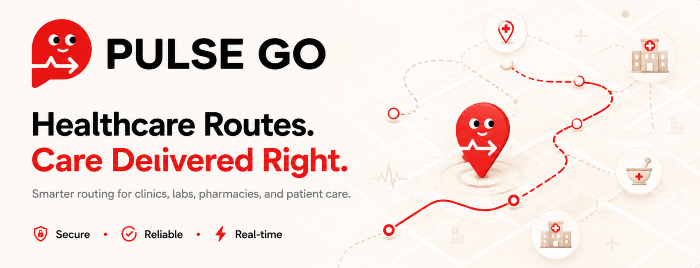
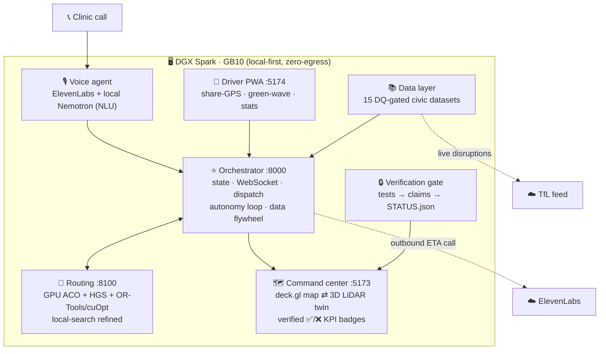

<div align="center">



# PulseGo

### Time-critical medical logistics for London — agentic, local-first, and test-backed.

[](https://luma.com/NVIDIA-Hack-London)
[](https://www.nvidia.com/en-gb/products/workstations/dgx-spark/)
[](#-built-for-hack-for-impact-london-nvidia)
[](verification/VERIFICATION.md)
[](tests/)
[](nemoclaw/)
[](https://pulsego.org)

**🔒 Secure  ·  ✅ Reliable  ·  ⚡ Real-time**

</div>

---

> A **local-first, agentic medical-courier optimiser** that collects pathology samples and
> delivers urgent medication across London **within clinical time windows** — re-planning live
> when a road closes, a courier drops out, or a STAT request arrives. It runs **entirely on a
> DGX Spark (GB10)**: patient data never leaves the box, and **every capability on screen is
> backed by an external test that passed.**

The agents *reason and communicate* (local **Nemotron** via **NemoClaw** + **ElevenLabs** voice);
the GPU *computes the routes* (custom GPU ACO + local search on the GB10). Grounded in **open City
of London data**.

```text
🩸  pathology samples + 💊 urgent meds   →   clinical deadlines (ABG <15min · coag ~4h · STAT)
🚦  live disruption (roadworks, closures, strikes)   →   re-plan in seconds, protect the window
🧠  local agents reason & narrate   ·   ⚙️ GPU solver routes   ·   ✅ tests gate every claim
```

---

## 📑 Contents

- [The problem](#-the-problem-why-this-matters)
- [What PulseGo does](#-what-pulsego-does)
- [Built for Hack for Impact London](#-built-for-hack-for-impact-london-nvidia)
- [Architecture](#-architecture)
- [Tech stack](#-tech-stack)
- [Open-data sources](#-grounded-in-open-london-data)
- [Quickstart](#-quickstart)
- [The verification gate](#-the-verification-gate-the-differentiator)
- [Research contribution](#-research-contribution)
- [Repo layout](#-repo-layout)
- [Feature wiki](#-explore-every-feature-wiki)

---

## 🚑 The problem (why this matters)

Nearly **every diagnosis depends on a sample reaching a lab in time.** NHS pathology runs
**~1.12 billion tests a year (£2.2bn)**, and **~95% of clinical pathways** rely on access to
pathology. But the samples are perishable and the city is hostile to schedules:

- **Tight clinical windows** — arterial blood gas must reach the lab in **< 15 min**, coagulation
  in **~4 h**, haematology in **< 24 h**. Miss the window and the result is clinically unreliable.
- **Transport is the #1 failure point** — in a 231k-sample study, **transport delay was the single
  largest cause of sample rejection (19.5%)**; missed windows mean repeat blood draws, delayed
  diagnoses, and wasted clinician time.
- **The network breaks constantly** — central-London hospital→lab road hops can exceed **30 min**;
  NHS strikes have cancelled **>1.5m appointments (~£1.7bn)**. Static routes fail under disruption.
- **The upside is proven** — optimised + drone routing (Apian/Matternet) has shown **83–85%
  delivery-time reductions**. The opportunity is real and quantifiable.

> **PulseGo's thesis:** an agentic dispatcher that *anticipates* published disruption and re-plans
> in real time — on live London open data — protects clinical time windows when the city's network
> fails. *(See the [research result](#-research-contribution): anticipation beats reactive OR-Tools.)*

## 💡 What PulseGo does

1. **Intake** — a clinic calls; the local voice agent transcribes and extracts a structured
   `DeliveryJob` (origin, destination, priority, time window, cold-chain).
2. **Plan** — the GPU routing portfolio computes courier routes, ETAs, and which clinical windows
   are met — in seconds.
3. **Visualise** — a dark mission-control command center: a live London **operations map** *or* a
   **3D LiDAR digital twin** of the Square Mile, glass KPIs, fleet roster.
4. **Disrupt** — a road closes (TfL feed / live disruption) → re-optimise → routes redraw to
   protect at-risk windows, while the agent narrates *why*.
5. **Communicate** — outbound ETA calls / narration to couriers and clinics (ElevenLabs).
6. **Verify** — every KPI shows a ✅/❌ badge read live from the test results. You can't fake a number.

## 🏆 Built for Hack for Impact London (NVIDIA)

PulseGo is purpose-built to the brief — *"build autonomous systems that think, act, and run
anywhere, whilst making a positive impact"* — and maps directly onto the judging signals:

| What the hackathon rewards | How PulseGo delivers |
|---|---|
| **Agentic AI on local NVIDIA hardware** | Multi-agent system on local **Nemotron** via **NemoClaw**; **GPU routing solver** on the GB10 — the Spark does heavy compute, not just chat. |
| **Grounded in open City of London data** | 15 DQ-gated civic datasets — TfL, NHS ODS, EA, air quality, flood, street-works, kerbside handoff zones and roadside signs (see [below](#-grounded-in-open-london-data)). |
| **Public Services + Urban Operations tracks** | Protects NHS clinical SLAs (Public Services) by optimising city-scale courier flow in real time (Urban Operations). |
| **Quantified, real-world impact** | Test-bound impact: **41/41 clinical windows met** vs 39 for naive dispatch; **100% STAT on-time**. |
| **Local-first / data residency** | **Zero-egress** NemoClaw policy — patient data never leaves the box; pull the network cable and it still routes. |
| **A working, polished demo** | Product-grade command center + 3D twin; **77/77 must-pass claims green, 232 tests passing**. |

## 🏗 Architecture

Everything runs on **one DGX Spark (GB10)** — local Nemotron for reasoning, local GPU for routing,
local web stack. The only outbound network is ElevenLabs (voice) and the TfL feed, both behind
**NemoClaw egress allowlists**.



Full control-flow + fallback ladder: **[`ARCHITECTURE.md`](ARCHITECTURE.md)**. Deploy: **[`DEPLOY.md`](DEPLOY.md)**.

## 🧰 Tech stack

**Compute / AI**

-76B900?logo=nvidia&logoColor=white)


**Backend / routing**


**Frontend**


**Infra**


## 🌍 Grounded in open London data

Fifteen datasets, **every one data-quality-gated** before it's served (`make data` →
[`data/manifest.json`](data/manifest.json), each with a SHA-256 and a bound DQ test). Live feeds
degrade gracefully to verified bundled/scheduled fallbacks — so *"pull the network cable"* still works.

| Layer | Source | Mode |
|---|---|---|
| NHS facilities (hospitals, GPs, labs, pharmacies) | NHS ODS + postcodes.io | Live → bundled fallback |
| Roads / buildings | OpenStreetMap (Overpass) | Live → synthetic fallback |
| Road disruptions · live CCTV | **TfL Unified API** (JamCams) | Live |
| Air quality | TfL AirQuality / LAQN | Live → fallback |
| Flood warnings | **Environment Agency** real-time | Live → fallback |
| Planned works | Street Manager-style roadworks | Scheduled |
| Kerbside handoff/loading points | London borough kerbside/loading restrictions | Scheduled |
| Roadside message signs | **TfL Unified API** VariableMessageSign | Live → fallback |
| Tower Bridge lifts · public events · signal junctions | published schedules | Scheduled |
| Weather | Open-Meteo | Live → bundled |
| NHS pressure · cycle infrastructure | NHS / TfL | Scheduled |
| Crowdsourced congestion probes | driver PWA flywheel | Live |
| **3D city twin** | **EA National LIDAR Programme** (tile TQ3080) | Baked asset (3M pts) |

See [`data/README.md`](data/README.md) for provenance details. Full open-data catalogue:
[London Datastore](https://data.london.gov.uk/).

## ⚡ Quickstart

```bash
make install          # python test + service deps
make data             # build + DQ-verify datasets -> data/manifest.json + map geojson
make verify           # the gate: exits non-zero unless every must-pass claim is GREEN

# run the stack (separate terminals)
cd routing      && uvicorn app:app --port 8100                                   # GPU routing service
cd orchestrator && ROUTING_URL=http://localhost:8100 uvicorn app:app --port 8000 # hub + WebSocket
cd frontend     && npm install && npm run dev                                    # http://localhost:5173
python scripts/demo_seed.py                                                      # now-anchored scenario
```

In the command center, use the **Map ⇄ LiDAR 3D** toggle to switch between the operations map and
the point-cloud city twin. Demo runbook: **[`DEMO.md`](DEMO.md)**.

## 🔒 The verification gate (the differentiator)

No human or model marks work done. [`verification/run.py`](verification/run.py) runs the external
test suites, maps each result onto [`verification/claims.yaml`](verification/claims.yaml), and
writes machine-readable [`STATUS.json`](verification/STATUS.json) (the UI reads it for its badges)
plus [`VERIFICATION.md`](verification/VERIFICATION.md). A claim is **Verified** *only* if its bound
test passed in the latest run; `make verify` exits non-zero unless every must-pass claim is green,
and CI enforces it on every push.

```
✅ 77 / 77 must-pass green   ·   87 / 88 claims verified   ·   232 tests passing
```

External tests gate claims across **impact, performance, contracts, data quality, research, and
e2e**. *You can't fake a number.*

## 🔬 Research contribution

[`RESEARCH.md`](RESEARCH.md) (N=30, paired Wilcoxon): **anticipating published disruption schedules**
(Tower Bridge lifts, event closures) significantly improves clinical STAT on-time delivery over
disruption-blind and live-only reactive routing — and the anticipatory planner **beats Google
OR-Tools operating reactively** (+0.10 STAT on-time, p=0.032). The win is the **information
advantage**: OR-Tools is the stronger static optimiser, but it can't route around a closure it
doesn't know is coming.

| policy | realised STAT on-time |
|---|---|
| Greedy (naive) | 0.88 |
| Ours — reactive (live feed) | 0.68 |
| OR-Tools — reactive | 0.90 |
| **Ours — anticipatory (schedule)** | **1.00** |

Plus a **delta-evaluation HGS solver** ([`routing/RESEARCH_HGS.md`](routing/RESEARCH_HGS.md)):
equal-or-better clinical quality at **~10× faster** time-to-quality than whole-plan local search,
externally re-scored.

## 📂 Repo layout

| Dir | What |
|-----|------|
| [`contracts/`](contracts/) | shared data model + orchestrator/routing API (the integration contract) |
| [`orchestrator/`](orchestrator/) | hub: state, WebSocket, dispatch, autonomy loop, data flywheel, auth |
| [`routing/`](routing/) | routing portfolio: greedy + insertion + GPU ACO + HGS + OR-Tools/cuOpt, LS-refined |
| [`voice/`](voice/) | ElevenLabs intake + outbound caller + driver voice assistant (FAQ→tools) |
| [`frontend/`](frontend/) | command-center: deck.gl map ⇄ Three.js LiDAR twin; verified badges; live layers |
| [`driver-app/`](driver-app/) | mobile PWA for drivers: signup, share-GPS, green-wave, contribution stats |
| [`data/`](data/) | 15 DQ-gated civic datasets + manifest gating |
| [`nemoclaw/`](nemoclaw/) | local-first sandbox policies (voice = ElevenLabs-only; routing = zero-egress) |
| [`verification/`](verification/) | claims ledger + gate (`run.py` → `STATUS.json` / `VERIFICATION.md`) |
| [`tests/`](tests/) | external suites: data-quality, contracts, backtests, benchmarks, e2e |

## 📖 Explore every feature (Wiki)

The **[GitHub Wiki](https://github.com/lukataylo/RLJ/wiki)** is the full feature showcase — the
command center, the 3D LiDAR twin, the routing portfolio, the agent network & voice, the data
flywheel, the civic data layers, and the verification gate, each with screenshots and how-it-works.

---

<div align="center">

**PulseGo** · Healthcare Routes. Care Delivered Right. · [pulsego.org](https://pulsego.org)
<br/>Built at **Hack for Impact London**, presented by **NVIDIA** · runs on **DGX Spark (GB10)**

</div>
